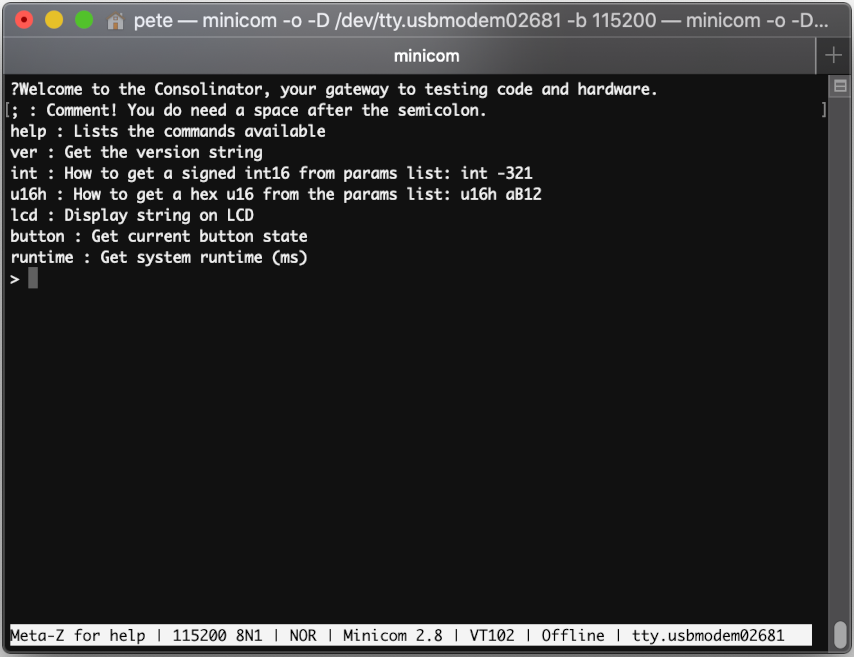
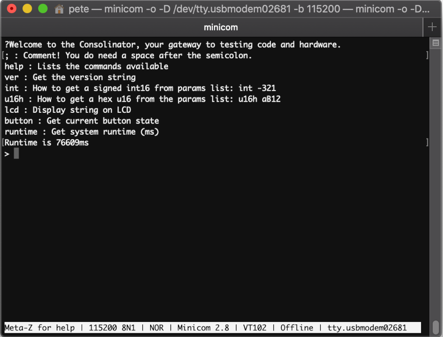
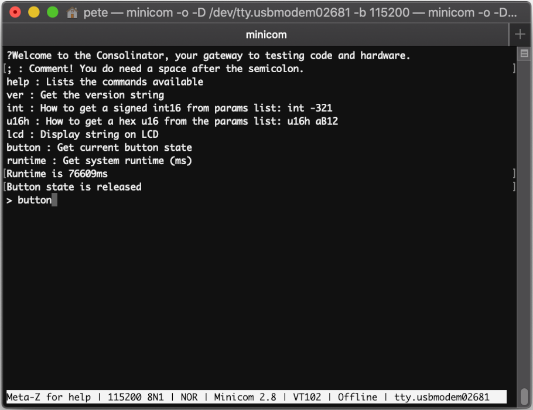
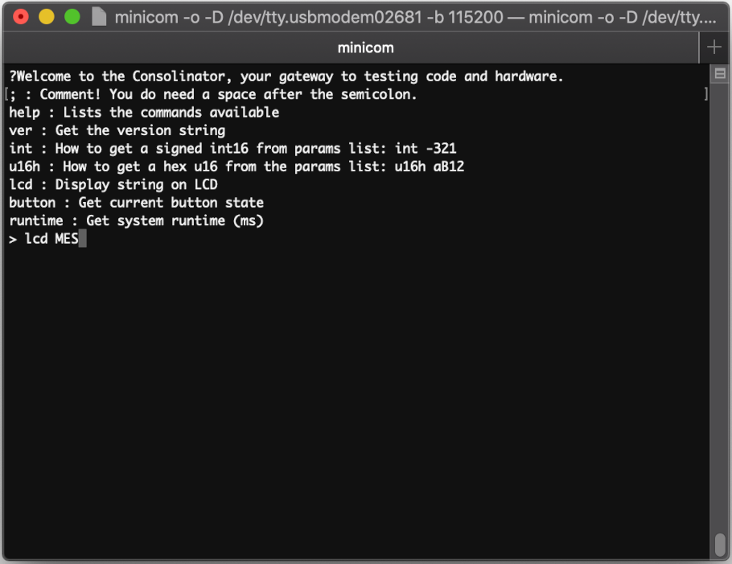
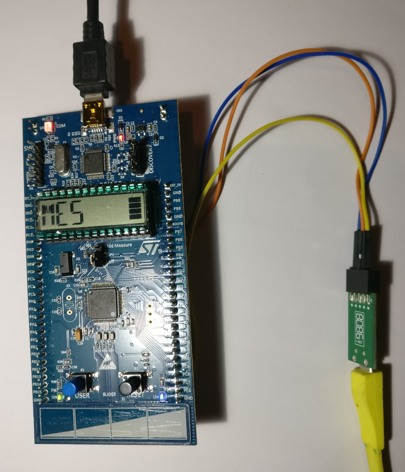

# Making Embedded Systems - Assignment 5
This project implements a UART debug interface to run on an STM32L1 Discovery Kit. The project makes use of [Elecia White's reusable command interface](https://github.com/eleciawhite/reusable/tree/master). In addition to the commands provided in the original command interface, commands have been added to:
- Display the system runtime in ms
- Display the current state of the user button
- Output a supplied string on the LCD display
  

## UART receive implementation
In order to ensure that the debug interface doesn't affect the operation of the rest of the system, a non-blocking method is used to read characters from the UART. The method used was inspired by [Dan Ramanayake's solution to this assignment](https://github.com/dananjayavr/mes_wk_5_cli).

The implementation of this method lives in `consoleIo.c`. The method initiates UART receives using interrupts. As each character is received an interrupt is triggered which is handled by `HAL_UART_RxCpltCallback`. The character is appended to a 10 character `receivedBuffer` and next index (`nextCharIdx`) is incremented. `ConsoleIoReceive` is periodically called by `ConsoleProcess` (which is called from the main loop) where any characters that have been received are transferred to the command buffer in `console.c`. After the recieved characters have been transferred, the `nextCharIdx` is reset back to 0.

One of the issues encountered during the development of this solution was that characters were sometimes being lost. It was discovered that these were being received while `ConsoleIoReceive` was running. This resulted in the characters not being transferred to the command buffer before `nextCharIdx` was reset back to 0. This effectively deleted the characters from the `receivedBuffer`. The solution to this issues is to temporarily disable the UART receive interrupt while `ConsoleIoReceive` is running. This allows character reception to work reliably.

`consoleIo.c` also contains a `ConsoleIoSendString` function. Originally this would send strings using `printf`. This worked most of the time but it was found that short strings (e.g. the input prompt) would not be sent straight away. Presumably a buffer was sitting between the `printf` call and the UART transmission. The solution to this issue was to directly call `HAL_UART_Transmit` for each character of the string until a NULL character is reached. This results in much more responsive string output but as it using blocking transmits it is possibly not the most efficient approach.

## Additional command implementation
The debug interface commands are all implemented in `consoleCommands.c`. For the additional commands the low level interaction with the hardware is handled in `applicationCommands.c`.

For the LCD display string command, the string to be displayed is fetched from the command buffer and passed to `LCDDIsplayString`. This makes use of functions provided in the BSP drivers collection to clear the LCD and then display the passed in string.

For the button state command, `GetButtonState` is called which uses `HAL_GPIO_ReadPin` in order to return the button state as a `bool`. The command returns a string that states whether the button is pressed or released.

For the system runtime command, the 32 bit timer 5 is started at system start up. This timer has its prescaler set so that it counts up in ms. In this configuration a runtime of just nearly 50 days can be stored before the timer rolls over.